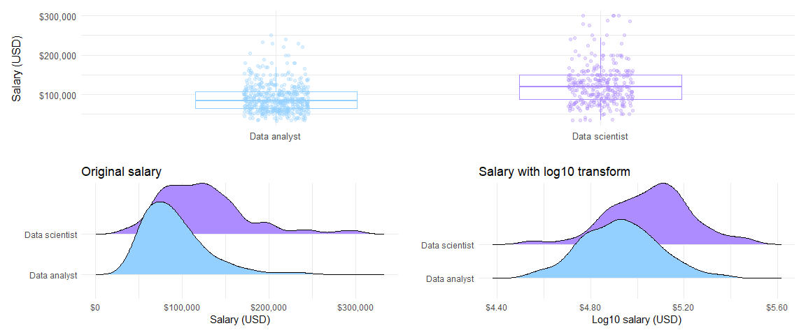
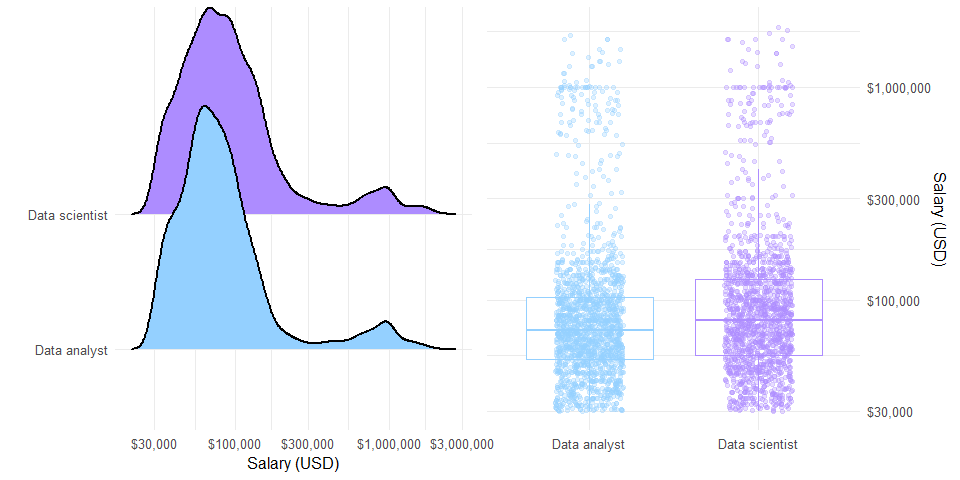
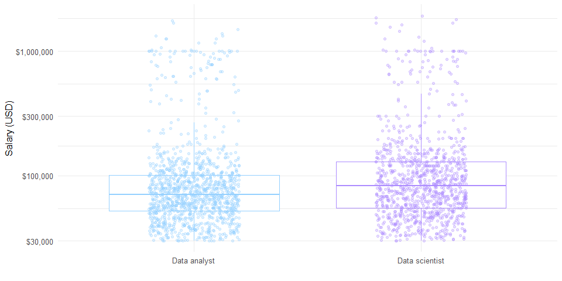
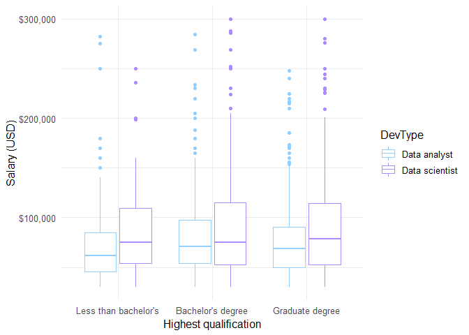
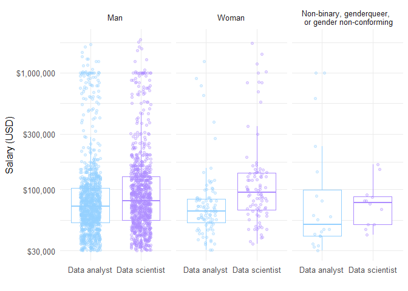
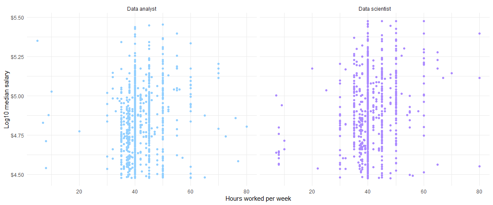
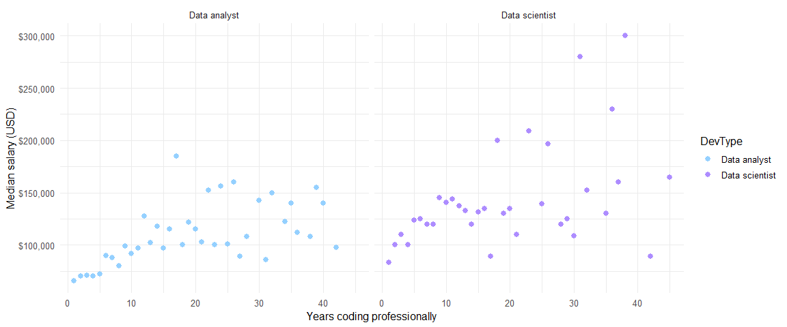
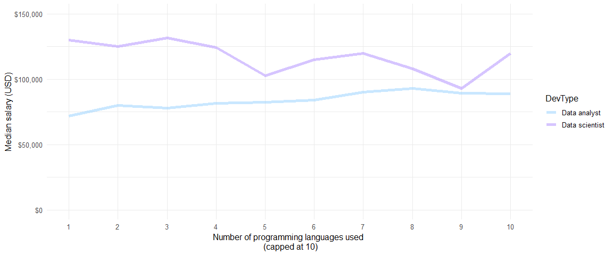
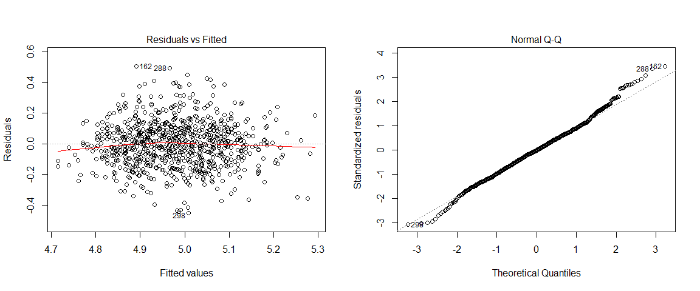
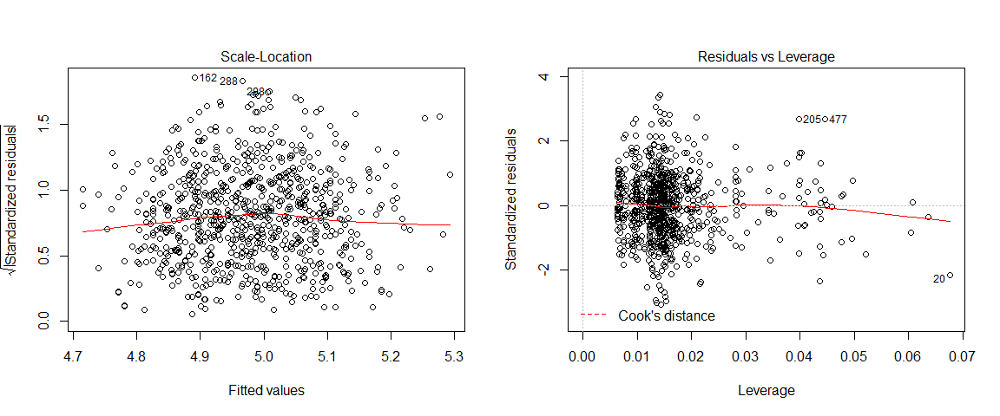

Stack Overflow Developer Survey 2019: Exploring the characteristics of
data scientists and data analysts
================

 

In this project I’ll be exploring survey responses from data scientists
and data analysts in [Stack Overflow’s 2019 Developer
Survey](https://insights.stackoverflow.com/survey/2019#overview). I’ll
be using the survey responses to build a statistical model of industry
salaries.

This project reuses code from Julia Silge’s brilliant analysis of
[gender and salary in the tech
industry](https://juliasilge.com/blog/salary-gender/) - I highly
recommend you check it out\!

#### Preparing the data

To fit a more accurate model of salary the data were filtered to:

  - full-time workers

  - residing in the United States

  - salaries between between $30,000 and $300,000

  - individual contributors working in industry only (i.e. removing
    upper management and academics)

This made the data more consistent for visualising and modelling. [This
analysis by Charles
Modingwa](https://medium.com/@charlesmodingwa/2019-stack-overflow-survey-analysis-c8dac1617d40)
showed that data scientist salaries differed across countries. Filtering
only to the United States removes any unwanted effects of country and
still leaves a good sample size.

Respondents were labelled as data analysts if they identified as a “Data
or business analyst” or a data scientist if identifying as “Data
scientist or machine learning specialist”. 162 respondents identified
with both labels. These responses were removed to focus the analysis on
the differences between the two groups. This left 821 responses,
consisting of 323 data scientists and 498 data analysts.

### Part 1 - Exploring the data

Before building a model, I’ll build some exploratory plots of salary and
other variables in the survey. I chose variables based on analyses that
have already looked at modelling salaries in this dataset, combined with
some additional variables I was interested in.

#### What do data scientists and data analysts earn?

If we take a look at salaries overall, the median salary is higher for
data scientists ($120,000) than for data analysts ($84,500). Salaries
for both groups are positively skewed due to small number of respondents
earning around $150,000 or more. For modelling purposes the salaries
will be log10 transformed to make them normally distributed.
<!-- -->

 

#### Does salary differ by gender identity?

The data shows that the majority of respondents identified as men. Data
scientists had higher median salaries than data analysts across the
gender groups. It’s possible that women are under-represented in this
sample, an issue that has been identified for the survey across all
developer roles. This means that, despite the boxplot indicating only a
small gender difference between men and women, this result may not
reflect the real world. 10 respondents in this sample identified as
trans.

<!-- -->

#### Do salaries increase with age, or is it about experience?

We would expect that salaries will increase with age and years of
professional experience as respondents move into more senior roles. The
ridge plots below show that age and years of professional coding are
distributed non-normally with a positive skew. Typically we can
log-transform skewed variables to make them more suitable for fitting
statistical models.

<!-- -->  

The scatter plot on the right shows that log transforming years of
professional coding doesn’t quite work for the lower end of the scale.
The transformed age plot on the left looks much cleaner and shows a
positive relationship between log age and log salary.

#### Does education affect future salaries?

Median salary was higher for data scientists at each aggregated
qualification level. Overall there was a stronger positive effect of
education on median earnings in the data scientist group compared to the
data analyst group. Breaking down salaries by undergrad major and
developer type shows that data scientists who studied maths or
statistics had the highest median salary while data analysts with a
social sciences background had the lowest median salary.

<!-- -->

<table>

<thead>

<tr>

<th style="text-align:left;">

UndergradMajor

</th>

<th style="text-align:left;">

DevType

</th>

<th style="text-align:right;">

Sample size

</th>

<th style="text-align:left;">

Median salary

</th>

</tr>

</thead>

<tbody>

<tr>

<td style="text-align:left;">

Mathematics or statistics

</td>

<td style="text-align:left;">

Data scientist

</td>

<td style="text-align:right;">

63

</td>

<td style="text-align:left;">

$130,000

</td>

</tr>

<tr>

<td style="text-align:left;">

A natural science (ex. biology, chemistry, physics)

</td>

<td style="text-align:left;">

Data scientist

</td>

<td style="text-align:right;">

30

</td>

<td style="text-align:left;">

$120,000

</td>

</tr>

<tr>

<td style="text-align:left;">

Computer science, computer engineering, or software engineering

</td>

<td style="text-align:left;">

Data scientist

</td>

<td style="text-align:right;">

149

</td>

<td style="text-align:left;">

$115,000

</td>

</tr>

<tr>

<td style="text-align:left;">

Information systems, information technology, or system administration

</td>

<td style="text-align:left;">

Data analyst

</td>

<td style="text-align:right;">

55

</td>

<td style="text-align:left;">

$90,000

</td>

</tr>

<tr>

<td style="text-align:left;">

Computer science, computer engineering, or software engineering

</td>

<td style="text-align:left;">

Data analyst

</td>

<td style="text-align:right;">

197

</td>

<td style="text-align:left;">

$88,000

</td>

</tr>

<tr>

<td style="text-align:left;">

A business discipline (ex. accounting, finance, marketing)

</td>

<td style="text-align:left;">

Data analyst

</td>

<td style="text-align:right;">

45

</td>

<td style="text-align:left;">

$80,000

</td>

</tr>

<tr>

<td style="text-align:left;">

A social science (ex. anthropology, psychology, political science)

</td>

<td style="text-align:left;">

Data analyst

</td>

<td style="text-align:right;">

36

</td>

<td style="text-align:left;">

$72,500

</td>

</tr>

</tbody>

</table>

#### Do employment variables affect salary?

There is an interesting interaction here: data analysts who are
primarily professional developers have a higher median log of salary
than those aren’t, but this effect is absent in the data scientist
group. There was a very small upward trend of salary ranges as
organisation size increased.  

<!-- -->

Most respondents in the sample worked 40 hours a week. The scatterplots
here suggest that higher working hours per week may result in higher
log10 salary, but fitting a linear relationship would be confounded by
the large number of respondents on the 40 hours line.

<!-- -->

#### Does knowing more programming languages relate to salary?

The number of programming languages used had a small positive effect on
median earnings in the data analyst group, however the effect was
somewhat negative in the data scientist group.

<!-- -->

#### Do open source contributors earn more?

Finally, the plot below shows that open source contributions have a
small positive effect on median salaries in the data scientist group but
not in the data analyst group.

<!-- -->

### Part 2 - Building a model

#### Multiple regression output

It’s clear that salaries are highly variable whichever way we look at
the data. The exploratory data analysis we’ve done so far suggests that
some variables could explain some of the variation in salaries, and this
is where modelling comes in\! Here I’ll try a multiple regression to
model salary on **developer type**, **professional vs. non-professional
developer**, **log transformed age**, **education level**, and **open
source contributions**, including some interaction terms based on the
exploratory plots.

<table>

<thead>

<tr>

<th style="text-align:right;">

r\_squared

</th>

<th style="text-align:right;">

adj\_r\_squared

</th>

<th style="text-align:right;">

mse

</th>

<th style="text-align:right;">

rmse

</th>

<th style="text-align:right;">

sigma

</th>

<th style="text-align:right;">

statistic

</th>

<th style="text-align:right;">

p\_value

</th>

<th style="text-align:right;">

df

</th>

</tr>

</thead>

<tbody>

<tr>

<td style="text-align:right;">

0.321

</td>

<td style="text-align:right;">

0.311

</td>

<td style="text-align:right;">

0.0215973

</td>

<td style="text-align:right;">

0.1469603

</td>

<td style="text-align:right;">

0.148

</td>

<td style="text-align:right;">

31.408

</td>

<td style="text-align:right;">

0

</td>

<td style="text-align:right;">

13

</td>

</tr>

</tbody>

</table>

<table>

<thead>

<tr>

<th style="text-align:left;">

term

</th>

<th style="text-align:right;">

estimate

</th>

<th style="text-align:right;">

std\_error

</th>

<th style="text-align:right;">

statistic

</th>

<th style="text-align:right;">

p\_value

</th>

<th style="text-align:right;">

lower\_ci

</th>

<th style="text-align:right;">

upper\_ci

</th>

</tr>

</thead>

<tbody>

<tr>

<td style="text-align:left;">

intercept

</td>

<td style="text-align:right;">

3.996

</td>

<td style="text-align:right;">

0.076

</td>

<td style="text-align:right;">

52.578

</td>

<td style="text-align:right;">

0.000

</td>

<td style="text-align:right;">

3.847

</td>

<td style="text-align:right;">

4.145

</td>

</tr>

<tr>

<td style="text-align:left;">

log\_age

</td>

<td style="text-align:right;">

0.601

</td>

<td style="text-align:right;">

0.050

</td>

<td style="text-align:right;">

11.900

</td>

<td style="text-align:right;">

0.000

</td>

<td style="text-align:right;">

0.502

</td>

<td style="text-align:right;">

0.700

</td>

</tr>

<tr>

<td style="text-align:left;">

DevTypeData scientist

</td>

<td style="text-align:right;">

0.173

</td>

<td style="text-align:right;">

0.035

</td>

<td style="text-align:right;">

4.902

</td>

<td style="text-align:right;">

0.000

</td>

<td style="text-align:right;">

0.104

</td>

<td style="text-align:right;">

0.243

</td>

</tr>

<tr>

<td style="text-align:left;">

OpenSourcerSometimes

</td>

<td style="text-align:right;">

0.000

</td>

<td style="text-align:right;">

0.020

</td>

<td style="text-align:right;">

0.009

</td>

<td style="text-align:right;">

0.993

</td>

<td style="text-align:right;">

\-0.039

</td>

<td style="text-align:right;">

0.039

</td>

</tr>

<tr>

<td style="text-align:left;">

OpenSourcerNever

</td>

<td style="text-align:right;">

\-0.010

</td>

<td style="text-align:right;">

0.018

</td>

<td style="text-align:right;">

\-0.568

</td>

<td style="text-align:right;">

0.570

</td>

<td style="text-align:right;">

\-0.045

</td>

<td style="text-align:right;">

0.025

</td>

</tr>

<tr>

<td style="text-align:left;">

EdLevelGraduate degree

</td>

<td style="text-align:right;">

0.015

</td>

<td style="text-align:right;">

0.018

</td>

<td style="text-align:right;">

0.822

</td>

<td style="text-align:right;">

0.411

</td>

<td style="text-align:right;">

\-0.021

</td>

<td style="text-align:right;">

0.050

</td>

</tr>

<tr>

<td style="text-align:left;">

EdLevelLess than bachelors

</td>

<td style="text-align:right;">

\-0.075

</td>

<td style="text-align:right;">

0.017

</td>

<td style="text-align:right;">

\-4.441

</td>

<td style="text-align:right;">

0.000

</td>

<td style="text-align:right;">

\-0.109

</td>

<td style="text-align:right;">

\-0.042

</td>

</tr>

<tr>

<td style="text-align:left;">

MainBranchProfessional developer

</td>

<td style="text-align:right;">

0.051

</td>

<td style="text-align:right;">

0.015

</td>

<td style="text-align:right;">

3.496

</td>

<td style="text-align:right;">

0.000

</td>

<td style="text-align:right;">

0.022

</td>

<td style="text-align:right;">

0.079

</td>

</tr>

<tr>

<td style="text-align:left;">

DevTypeData scientist:OpenSourcerSometimes

</td>

<td style="text-align:right;">

\-0.039

</td>

<td style="text-align:right;">

0.029

</td>

<td style="text-align:right;">

\-1.369

</td>

<td style="text-align:right;">

0.171

</td>

<td style="text-align:right;">

\-0.096

</td>

<td style="text-align:right;">

0.017

</td>

</tr>

<tr>

<td style="text-align:left;">

DevTypeData scientist:OpenSourcerNever

</td>

<td style="text-align:right;">

\-0.022

</td>

<td style="text-align:right;">

0.027

</td>

<td style="text-align:right;">

\-0.817

</td>

<td style="text-align:right;">

0.414

</td>

<td style="text-align:right;">

\-0.075

</td>

<td style="text-align:right;">

0.031

</td>

</tr>

<tr>

<td style="text-align:left;">

DevTypeData scientist:EdLevelGraduate degree

</td>

<td style="text-align:right;">

0.032

</td>

<td style="text-align:right;">

0.025

</td>

<td style="text-align:right;">

1.285

</td>

<td style="text-align:right;">

0.199

</td>

<td style="text-align:right;">

\-0.017

</td>

<td style="text-align:right;">

0.082

</td>

</tr>

<tr>

<td style="text-align:left;">

DevTypeData scientist:EdLevelLess than bachelors

</td>

<td style="text-align:right;">

\-0.004

</td>

<td style="text-align:right;">

0.036

</td>

<td style="text-align:right;">

\-0.105

</td>

<td style="text-align:right;">

0.916

</td>

<td style="text-align:right;">

\-0.074

</td>

<td style="text-align:right;">

0.066

</td>

</tr>

<tr>

<td style="text-align:left;">

DevTypeData scientist:MainBranchProfessional developer

</td>

<td style="text-align:right;">

\-0.051

</td>

<td style="text-align:right;">

0.029

</td>

<td style="text-align:right;">

\-1.732

</td>

<td style="text-align:right;">

0.084

</td>

<td style="text-align:right;">

\-0.109

</td>

<td style="text-align:right;">

0.007

</td>

</tr>

</tbody>

</table>

Given the variability in the data, an adjusted R-squared of 0.31 isn’t
bad\! The model has accounted for about 31% of the variance in log of
salary. The one continuous variable in the model (log of age) has a
significant positive effect on average log of salary. There is also a
significant positive effect of being a data scientist on the average log
of salary. There is a significant negative effect of not having at least
a bachelor’s degree for data analysts but not for data scientists. Being
a professional developer significantly increases log of salary for data
analysts but does not have an effect on data scientist salaries. Open
source contributions didn’t have an effect in either group.

#### Everybody’s favourite - checking assumptions\!

It’s important to check that the regression has met the underlying
assumptions before drawing conclusions:

  - **Linearity** of relationships between independent and dependent
    variables - we can be satisfied this assumption is met by looking at
    the EDA plots and by checking that there is no pattern when plotting
    fitted values against residuals
  - **Independence** of residuals - responses come from different
    individuals, so we meet this criterion
  - **Normality of residuals** - the normal Q-Q below shows our
    residuals are distributed normally across log of salary
  - **Homogeneity of variance** - we can check this assumption using a
    scale-location plot and checking there is no linear pattern, which
    is what we find here

We can also check the Residuals vs Leverage plot to make sure outliers
are not significantly affecting the regression coefficients. The plot
here doesn’t show any observations outside of Cook’s distance, so we can
assume that outliers aren’t having a large impact on the model.

<!-- -->

<!-- -->

### Conclusion

This project was a lot of fun to work through\! There are clearly many
factors that can influence data scientist and data analyst salaries that
weren’t captured here, but we did find a positive effect of age and some
interesting interactions between developer type, education level, and
whether or not a person is a professional developer. There are some
further analyses we could do to improve on the multiple regression model
we built here, for example a linear mixed effects model including
organisation size and undergraduate major as random effects (this type
of model is covered in Julia Silge’s post).

**Thanks for reading :)**
