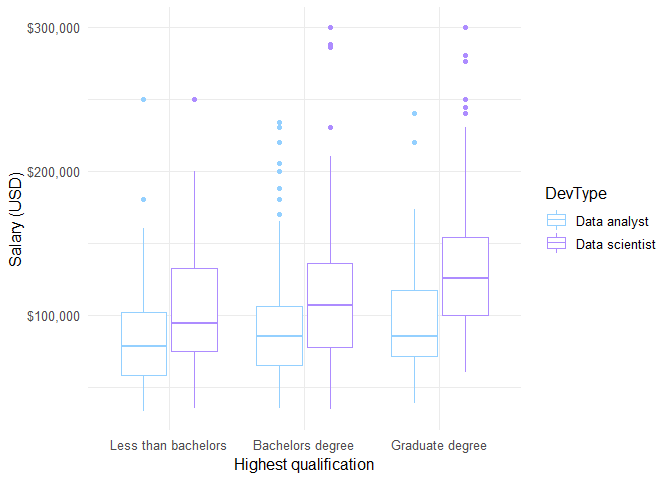
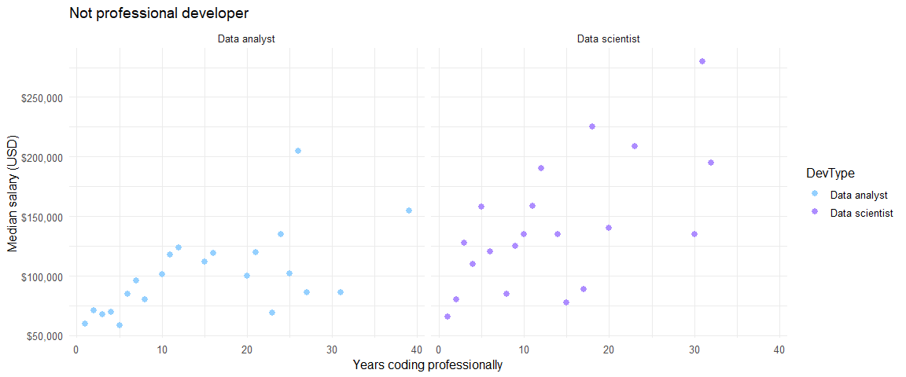

Stack Overflow Developer Survey 2019: Exploring the characteristics of
data scientists and data analysts
================

 

In this project I’ll be exploring survey responses from data scientists
and data analysts in [Stack Overflow’s 2019 Developer
Survey](https://insights.stackoverflow.com/survey/2019#overview). I’ll
be using the survey responses to model industry salaries (converted to
US Dollars or USD). Huge credit goes Julia Silge’s brilliant analysis of
[gender and salary in the tech
industry](https://juliasilge.com/blog/salary-gender/) for both inspiring
the project and for providing useful code for wrangling the survey data.

#### Notes on data prep

To fit a more accurate model of salary the data were filtered to:

  - full-time workers

  - salaries between between $30,000 and $300,000

  - individual contributors working in industry only (i.e. removing
    upper management and academics)

Respondents were labelled as data analysts if they identified as a “Data
or business analyst” or a data scientist if identifying as “Data
scientist or machine learning specialist”. 405 respondents identified
with both labels. These responses were removed to focus the analysis on
the differences between the two groups. This left 2150 responses,
consisting of 973 data scientists and 1177 data analysts.

### Exploring the data

Before building a model, I’ll build some exploratory plots of salary and
other variables in the survey. This will help to select relevant
variables for the model.

#### What do data scientists and data analysts earn?

If we take a look at salaries overall, the median salary for data
scientists is slightly higher ($76,416) than for data analysts
($68,000). Salaries for both groups are positively skewed, so fitting a
linear model to the data will require a log10 transform.
<!-- -->

 

#### Demographics

##### Gender identity

The data shows that the majority of respondents indentified as men. Data
scientists had higher median salaries than data analysts across the
gender groups. It’s possible that women are under-represented in this
sample, an issue that has been identified for the survey overall. This
means between-gender differences may not generalise beyond the sample.
16 respondents in this sample identified as trans.

<!-- -->

<table>

<thead>

<tr>

<th style="text-align:left;">

DevType

</th>

<th style="text-align:left;">

Man

</th>

<th style="text-align:left;">

Woman

</th>

<th style="text-align:left;">

Non-binary/genderqueer/gender non-conforming

</th>

<th style="text-align:left;">

Not available

</th>

</tr>

</thead>

<tbody>

<tr>

<td style="text-align:left;">

Data analyst

</td>

<td style="text-align:left;">

89.4% (1052)

</td>

<td style="text-align:left;">

7.4% (87)

</td>

<td style="text-align:left;">

1.4% (17)

</td>

<td style="text-align:left;">

1.8% (21)

</td>

</tr>

<tr>

<td style="text-align:left;">

Data scientist

</td>

<td style="text-align:left;">

88.7% (863)

</td>

<td style="text-align:left;">

8.1% (79)

</td>

<td style="text-align:left;">

1.2% (12)

</td>

<td style="text-align:left;">

2.0% (19)

</td>

</tr>

</tbody>

</table>

##### Age

The median age of the sample was 31. The distributions of ages were
positively skewed. There was no clear relationship between age and
salary for either group.

<!-- -->

#### Education

Median salary was higher for data scientists at each aggregated
qualification level. Overall there was little effect of education on
data scientist earnings, whereas earnings were slightly higher for data
analysts with at least a bachelor’s degree. Breaking down salaries by
undergrad major and developer type shows that data scientists who
studied maths or statistics had the highest median earnings whereas data
analysts who’d studied maths or statistics had the lowest.

<!-- -->

<table>

<thead>

<tr>

<th style="text-align:left;">

UndergradMajor

</th>

<th style="text-align:left;">

DevType

</th>

<th style="text-align:right;">

Sample size

</th>

<th style="text-align:left;">

Median salary

</th>

</tr>

</thead>

<tbody>

<tr>

<td style="text-align:left;">

Mathematics or statistics

</td>

<td style="text-align:left;">

Data scientist

</td>

<td style="text-align:right;">

163

</td>

<td style="text-align:left;">

$90,066

</td>

</tr>

<tr>

<td style="text-align:left;">

A natural science (ex. biology, chemistry, physics)

</td>

<td style="text-align:left;">

Data scientist

</td>

<td style="text-align:right;">

101

</td>

<td style="text-align:left;">

$83,000

</td>

</tr>

<tr>

<td style="text-align:left;">

Another engineering discipline (ex. civil, electrical, mechanical)

</td>

<td style="text-align:left;">

Data scientist

</td>

<td style="text-align:right;">

85

</td>

<td style="text-align:left;">

$75,237

</td>

</tr>

<tr>

<td style="text-align:left;">

A natural science (ex. biology, chemistry, physics)

</td>

<td style="text-align:left;">

Data analyst

</td>

<td style="text-align:right;">

61

</td>

<td style="text-align:left;">

$73,328

</td>

</tr>

<tr>

<td style="text-align:left;">

Computer science, computer engineering, or software engineering

</td>

<td style="text-align:left;">

Data scientist

</td>

<td style="text-align:right;">

492

</td>

<td style="text-align:left;">

$72,697

</td>

</tr>

<tr>

<td style="text-align:left;">

Information systems, information technology, or system administration

</td>

<td style="text-align:left;">

Data analyst

</td>

<td style="text-align:right;">

127

</td>

<td style="text-align:left;">

$70,548

</td>

</tr>

<tr>

<td style="text-align:left;">

Another engineering discipline (ex. civil, electrical, mechanical)

</td>

<td style="text-align:left;">

Data analyst

</td>

<td style="text-align:right;">

83

</td>

<td style="text-align:left;">

$70,000

</td>

</tr>

<tr>

<td style="text-align:left;">

A business discipline (ex. accounting, finance, marketing)

</td>

<td style="text-align:left;">

Data analyst

</td>

<td style="text-align:right;">

90

</td>

<td style="text-align:left;">

$68,725

</td>

</tr>

<tr>

<td style="text-align:left;">

Computer science, computer engineering, or software engineering

</td>

<td style="text-align:left;">

Data analyst

</td>

<td style="text-align:right;">

505

</td>

<td style="text-align:left;">

$68,705

</td>

</tr>

<tr>

<td style="text-align:left;">

A social science (ex. anthropology, psychology, political science)

</td>

<td style="text-align:left;">

Data analyst

</td>

<td style="text-align:right;">

51

</td>

<td style="text-align:left;">

$68,000

</td>

</tr>

<tr>

<td style="text-align:left;">

A humanities discipline (ex. literature, history, philosophy)

</td>

<td style="text-align:left;">

Data analyst

</td>

<td style="text-align:right;">

37

</td>

<td style="text-align:left;">

$64,800

</td>

</tr>

<tr>

<td style="text-align:left;">

Mathematics or statistics

</td>

<td style="text-align:left;">

Data analyst

</td>

<td style="text-align:right;">

66

</td>

<td style="text-align:left;">

$61,825

</td>

</tr>

</tbody>

</table>

#### Employment

Median salaries were highest for data scientists who weren’t
professional developers. Smaller organisation sizes were combined to
reduce the number of size bands. There was an upward trend of salary
ranges as organisation size increased.  

<!-- -->

Most respondents in the sample worked 40 hours a week. The scatterplots
below suggest that higher working hours per week don’t result in higher
salaries\!

<!-- -->

#### Coding & technical skills

##### Years coding

If we take the median salary for each year of professional coding
experience, we see a positive relationship for data scientists and data
analysts regardless of whether they code
professionally.

<!-- --><!-- -->

##### Open source

Finally, the plot below shows that open source contributions don’t seem
to affect salary\!

<!-- -->
