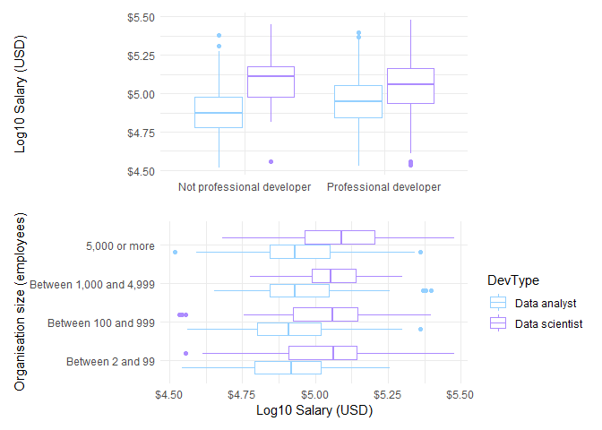

Stack Overflow Developer Survey 2019: Exploring the characteristics of
data scientists and data analysts
================

 

In this project I’ll be exploring survey responses from data scientists
and data analysts in [Stack Overflow’s 2019 Developer
Survey](https://insights.stackoverflow.com/survey/2019#overview). I’ll
be using the survey responses to build statistical models of industry
salaries. This project reuses code from Julia Silge’s brilliant analysis
of [gender and salary in the tech
industry](https://juliasilge.com/blog/salary-gender/).

#### Preparing the data

To fit a more accurate model of salary the data were filtered to:

  - full-time workers

  - residing in the United States

  - salaries between between $30,000 and $300,000

  - individual contributors working in industry only (i.e. removing
    upper management and academics)

This made the data more consistent for visualising and modelling. [This
analysis by Charles
Modingwa](https://medium.com/@charlesmodingwa/2019-stack-overflow-survey-analysis-c8dac1617d40)
showed that data scientist salaries differed across countries. Filtering
only to the United States removes any unwanted effects of country and
still leaves a good sample size.

Respondents were labelled as data analysts if they identified as a “Data
or business analyst” or a data scientist if identifying as “Data
scientist or machine learning specialist”. 162 respondents identified
with both labels. These responses were removed to focus the analysis on
the differences between the two groups. This left 821 responses,
consisting of 323 data scientists and 498 data analysts.

### Part 1 - Exploring the data

Before building a model, I’ll build some exploratory plots of salary and
other variables in the survey. I chose variables based on analyses that
have already looked at modelling salaries in this dataset, combined with
some additional variables I was interested in.

#### What do data scientists and data analysts earn?

If we take a look at salaries overall, the median salary is higher for
data scientists ($120,000) than for data analysts ($84,500). Salaries
for both groups are positively skewed due to small number of respondents
earning about $150,000 or more. For modelling purposes the salaries will
be log10 transformed to make them more normally distributed.
<!-- -->

 

#### Does salary differ by gender identity?

The data shows that the majority of respondents indentified as men. Data
scientists had higher median salaries than data analysts across the
gender groups. It’s possible that women are under-represented in this
sample, an issue that has been identified for the survey across all
developer roles. This means that, despite the boxplot indicating only a
small gender difference between men and women, this result may not
reflect the real world. 10 respondents in this sample identified as
trans.

<!-- -->

#### Do salaries increase with age, or is it about experience?

We would expect that salaries will increase with age and years of
professional experience as respondents move into more senior developer
roles. The ridge plots below show that age and years of professional
coding are distributed non-normally with a positive skew. Typically we
can log-transform skewed variables to make them more suitable for
fitting statistical models.

<!-- -->  

The scatter plot on the right shows that log transforming years of
professional coding doesn’t quite work for the lower end of the scale.
The transformed age plot on the left looks much cleaner and shows a
positive relationship between log age and log salary.

#### Does education affect future salaries?

Median salary was higher for data scientists at each aggregated
qualification level. Overall there was a stronger positive effect of
education on median earnings in the data scientist group compared to the
data analyst group. Breaking down salaries by undergrad major and
developer type shows that data scientists who studied maths or
statistics had the highest median salary while data analysts with a
social sciences background had the lowest median salary.

<!-- -->

<table>

<thead>

<tr>

<th style="text-align:left;">

UndergradMajor

</th>

<th style="text-align:left;">

DevType

</th>

<th style="text-align:right;">

Sample size

</th>

<th style="text-align:left;">

Median salary

</th>

</tr>

</thead>

<tbody>

<tr>

<td style="text-align:left;">

Mathematics or statistics

</td>

<td style="text-align:left;">

Data scientist

</td>

<td style="text-align:right;">

63

</td>

<td style="text-align:left;">

$130,000

</td>

</tr>

<tr>

<td style="text-align:left;">

A natural science (ex. biology, chemistry, physics)

</td>

<td style="text-align:left;">

Data scientist

</td>

<td style="text-align:right;">

30

</td>

<td style="text-align:left;">

$120,000

</td>

</tr>

<tr>

<td style="text-align:left;">

Computer science, computer engineering, or software engineering

</td>

<td style="text-align:left;">

Data scientist

</td>

<td style="text-align:right;">

149

</td>

<td style="text-align:left;">

$115,000

</td>

</tr>

<tr>

<td style="text-align:left;">

Information systems, information technology, or system administration

</td>

<td style="text-align:left;">

Data analyst

</td>

<td style="text-align:right;">

55

</td>

<td style="text-align:left;">

$90,000

</td>

</tr>

<tr>

<td style="text-align:left;">

Computer science, computer engineering, or software engineering

</td>

<td style="text-align:left;">

Data analyst

</td>

<td style="text-align:right;">

197

</td>

<td style="text-align:left;">

$88,000

</td>

</tr>

<tr>

<td style="text-align:left;">

A business discipline (ex. accounting, finance, marketing)

</td>

<td style="text-align:left;">

Data analyst

</td>

<td style="text-align:right;">

45

</td>

<td style="text-align:left;">

$80,000

</td>

</tr>

<tr>

<td style="text-align:left;">

A social science (ex. anthropology, psychology, political science)

</td>

<td style="text-align:left;">

Data analyst

</td>

<td style="text-align:right;">

36

</td>

<td style="text-align:left;">

$72,500

</td>

</tr>

</tbody>

</table>

#### Do employment variables affect salary?

Median salaries were similar between respondents who develope
professionally and those who don’t develop professionally. There was an
upward trend of salary ranges as organisation size increased.  

<!-- -->

Most respondents in the sample worked 40 hours a week. The scatterplots
here suggest that higher working hours per week may result in higher
log10 salary, but fitting a linear relationship would be confounded by
the large number of respondents on the 40 hours line.

<!-- -->

#### Does knowing more programming languages relate to salary?

The number of programming languages used had a small positive effect on
median earnings in the data analyst group, however the effect was
somewhat negative in the data scientist group.

<!-- -->

#### Do open source contributors earn more?

Finally, the plot below shows that open source contributions have a
small positive effect on median salaries in the data scientist group but
less of an effect in the data analyst group.

<!-- -->
