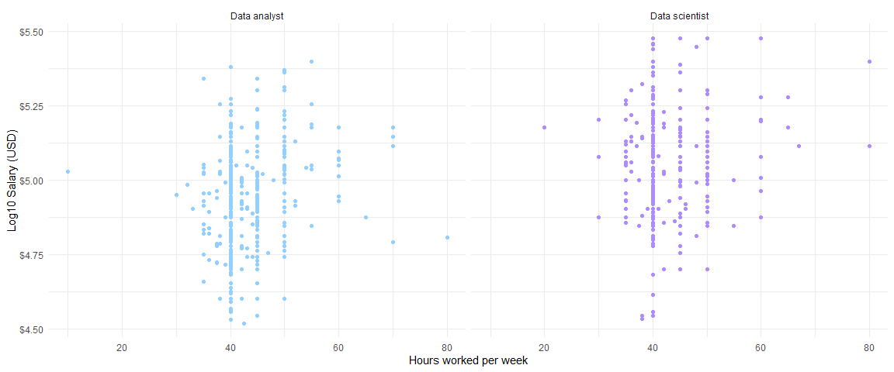

Stack Overflow Developer Survey 2019: Exploring the characteristics of
data scientists and data analysts
================

 

In this project I’ll be exploring survey responses from data scientists
and data analysts in [Stack Overflow’s 2019 Developer
Survey](https://insights.stackoverflow.com/survey/2019#overview).
Towards the end I’ll use the survey responses to predict salaries
(converted to US Dollars or USD). This project was inspired by Julia
Silge’s brilliant analysis of [gender and salary in the tech
industry](https://juliasilge.com/blog/salary-gender/).

#### Notes on data preparation

To fit a more accurate model of salary the data were filtered to:

  - full-time workers

  - salaries between between $30,000 and $2,000,000 (salaries below this
    are unlikely to be full-time, salaries above are most likely
    threshold values; see the [survey
    methodology](https://insights.stackoverflow.com/survey/2019#methodology))

  - individual contributors working in industry only (i.e. removing
    upper management and academics)

Respondents were labelled as data analysts if they identified as a “Data
or business analyst” or a data scientist if identifying as “Data
scientist or machine learning specialist”. 436 respondents identified
with both labels. These responses were removed to focus the analysis on
the differences between the two groups. This left 2326 responses,
consisting of 1058 data scientists and 1268 data analysts.

### Exploring the data

#### What do data scientists and data analysts earn?

If we take a look at salaries overall, the median salary for data
scientists is slightly higher than for data analysts. Salaries in both
groups are concentrated between $30,000 and $200,000 with a small number
scattered between $200,000 and the maximum $2,000,000.
<!-- -->

| DevType        | Median salary | Min salary | Max salary |
| :------------- | ------------: | ---------: | ---------: |
| Data analyst   |       70580.5 |      30095 |    1750000 |
| Data scientist |       83192.0 |      30051 |    1920000 |

 

#### Demographics

##### Gender identity

The data shows that the majority of respondents indentified as men. Data
scientists had higher median salaries than data analysts across the
gender groups. It’s possible that women are under-represented in this
sample, an issue that has been identified for the survey overall. This
means between-gender differences may not generalise beyond the sample.
19 respondents in this sample identified as trans.

<!-- -->

<table>

<thead>

<tr>

<th style="text-align:left;">

DevType

</th>

<th style="text-align:left;">

Man

</th>

<th style="text-align:left;">

Woman

</th>

<th style="text-align:left;">

Non-binary/genderqueer/gender non-conforming

</th>

<th style="text-align:left;">

Not available

</th>

</tr>

</thead>

<tbody>

<tr>

<td style="text-align:left;">

Data analyst

</td>

<td style="text-align:left;">

89.4% (1134)

</td>

<td style="text-align:left;">

7.3% (92)

</td>

<td style="text-align:left;">

1.6% (20)

</td>

<td style="text-align:left;">

1.7% (22)

</td>

</tr>

<tr>

<td style="text-align:left;">

Data scientist

</td>

<td style="text-align:left;">

88.5% (936)

</td>

<td style="text-align:left;">

8.5% (90)

</td>

<td style="text-align:left;">

1.1% (12)

</td>

<td style="text-align:left;">

1.9% (20)

</td>

</tr>

</tbody>

</table>

#### Age

The median age of the sample was 31. The distributions of ages were
similar for data analysts and data scientists. There was no clear
relationship between age and salary for either group.

<!-- -->
